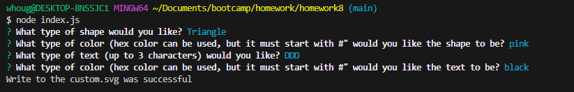
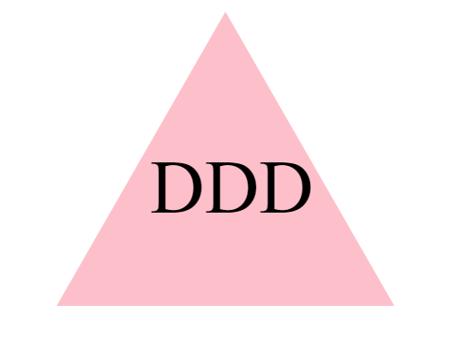

# SVG Logo Maker

## Description
The application generates a logo.svg to the examples folder.  The SVG file is generated from the user inputs of a shape, the shape's color, text, and the text's color.  The user is allowed to use color name or hex color.  Also, the user input up to 3 max characters for the text.

GitHub URL: https://github.com/whougie/svg-logo-maker.git

## Usage
Run 'node index.js' to start the application.

Insert values into the prompt.

Generates logo.svg placed in the 'examples' folder.

## Test
Run 'npm test run' to run test using Jest.